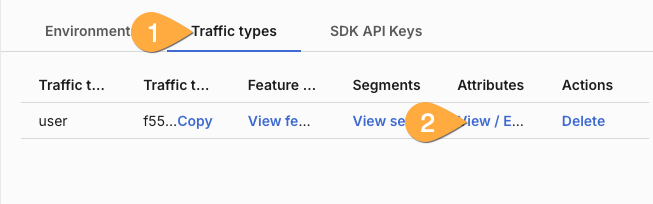

# Overview

The application shows the navigation bar of many users at once. Each title bar is an independent user with name, settings, and geographic location. The goal was to provide a real-world example making it easy to understand progressive feature release and dynamic configuration.

The scenario: We work for GlobalCorp and our job is to implement the new **OmniView** feature. It allows our users to see all of their content in a single screen. There are performance concerns- although in isolated test environments everything was OK. With Harness FME, we'll be able to progressively rollout the feature, monitor it, and rollback immediately if any issues arise.

Also, the content management team at GlobalCorp isn't technical, but keeps requesting code changes to modify the Contact Us page. Using dynamic configuration, we'll allow that team to handle the wording and images without code changes.

# Setup

First, we'll configure Harness FME to use our application, and then launch the application with streaming updates from Harness.

## Harness FME

These steps configure FME for a new project with 2 attributes. The attributes are built into the application to safely identify users without exposing any sensitive information.

### Create project

1. Login to your Harness FME account.
1. Click the _invite_ button (bottom left blue navbar) to reach admin settings.
   
1. Select _projects_ (inset grey menu) and then _Create Project_ top right corner.
1. Name your project `GlobalCorp` (name can be anything) and click _Create_.

   ### Retrieve SDK key

1. Find your app, go over to the right, then under _Actions_ click _View_.
1. In the tabs at the top, click _SDK API Keys_, find the `Client Side` & `Prod` version of your application
   
1. Save this key for later when setting up the application.
   ### Add attributes
1. In the tabs at the top, click _Traffic types_, then under Attributes _View/Edit_.
   
1. In the top right corner, click _Actions_, then _Create an attribute_.
1. Name it `Preview`, give it a description (optional) and choose Type: Boolean. Click _Save_

   :::caution
   Make sure use the exact name and case of the attributes- the application is looking for flags that match!
   :::

1. Click _Actions_, _Create_ again. Name the second attribute Region, choose Type: String, and add these suggested values:
   ```bash
   GB, US, CA, DK, FR
   ```
1. Click _Save_.

   ### Add feature flags

1. On the left blue bar, click _project_, then your project (i.e. _GlobalCorp_), then _feature flags_.
1. On the inset menu, click _Create feature flag_. Name it `OmniView`. Open the _treatments_ accordian on the right and confirm the options are simply 'on' and 'off'.
1. Click _create feature flag_ again on the inset menu and name it `Contact_Us`. (again, name and case is important!)
1. Ensure _Production Environment_ is selected, open the Treatments accordian, and update the Treatments section as follows:

   | Name                      | Description       |
   | ------------------------- | ----------------- |
   | direct                    | direct callout    |
   | indirect                  | indirect callout  |
   | friendly                  | friendly approach |
   | default treatment (below) | direct            |

   

1. Below the treatments section, choose Format: _JSON_, and then copy the JSON blocks below into each section:

   ```bash title="direct"
    {
   "message": "Call us for help anytime!",
   "image": "/help1.png"
   }
   ```

   ```bash title="indirect"
   {
   "message": "We're here if you need us!!",
   "image": "/help3.png"
   }
   ```

   ```bash title="friendly"
   {
   "message": "We get it! Things get confusing, we can help.",
   "image": "/help2.png"
   }
   ```

   

1. Finally, in the Targeting section, switch the targeting rules to _Distribute treatments as follows_ and split the methods evenly (33,33,34).

   ## Application

   The application is a simple next.js/react/javascript application running in a container. The full repo is available [here](https://github.com/suchcodewow/userflags) if you want to modify or build on it.

   ### Option 1: Docker Compose

1. To get up and running quickly, use the following command to download the docker compose file.

   ```bash
   curl -k -L 'https://raw.githubusercontent.com/suchcodewow/userflags/refs/heads/main/docker-compose.yaml' > docker-compose.yaml
   ```

1. Edit the yaml file and drop in the FME key you generated.

   ```bash
       ports:
       - 80:3000 <- Change 80 to another port if needed
       environment:
       PUBLIC_NEXT_SPLIT_KEY: "" <- Add your key between quotes
       NEXT_PUBLIC_TRAFFIC_TYPE: ""
   ```

1. (Optional) Modify the port to something else if you have another web server running on port 80.
1. Launch the container with:

   ```bash
   docker compose up -d
   ```

1. Open a browser and point it to `http://localhost`. (Or http://localhost:YourCustomPort)

   ### Option 2: Build locally

1. Clone the full repository locally with:

   ```bash
   git clone https://github.com/suchcodewow/userflags
   ```

1. In the directory where you downloaded the application, rename `example.env` to `.env`.
1. Edit the file and add your SDK key between the quotes:

   ```bash
   NEXT_PUBLIC_SPLIT_KEY="YOUR KEY HERE"
   NEXT_PUBLIC_TRAFFIC_TYPE=""
   ```

1. Install packages and start the development server with:

   ```bash
   npm Install
   npm run dev
   ```

1. Open a browser to `http://localhost:3000`.

   # Using the application

   You can use multiple target types for the new OmniView feature- and the content management team can dynamically adjust wording/images.

1. At the start, your application should like this:
   
   ## User target
1. In Harness FME, ensure your project is selected, click _Feature flags_, _production environment_ on the inset tab, and then open the _Targeting_ accordian.
1. Click _+ Add new individual target_, type in `RHart` (spelling and case matter), click _+ Add_, and then _Review Changes_ blue button at the top.
1. Click _Save_ on the pop-up. The application will immediately reflect that RHart has access to OmniView!
   

   :::caution
   There is a hard-coded 60 second delay between application startup and feature flag streaming turning "on". This is to reduce noise from extremely ephemeral applications and services starting during builds/testing. It's best to start the application at least a minute before demoing instant changes in feature flags.
   :::

   ## Attribute based targets

1. To use attribute based targeets, scroll to targeting rules and click _Add attribute based targeting rules_.
1. You can target users you have "opted in" to preview features (these are shown with an orange background behind their avatars) by selecting User attribute-> Preview, IS, TRUE.
1. Remember to click _Review changes_ and _save_. All preview users (orange avatar background) will immediately have OmniView.
   
1. And/or enable the flag based on geography attribute!
   

   ## Modifying dynamic content

   The content management team received several messages from users receiving the `indirect` treatment. Apparently users didn't like being portrayed as a drowning person. Weird.  
   Fortunately, the team has prepared additional images and with Dynamic configuration, the content management team can immediately address this.
   

1. Click "Contact Us" on any user's title bar to zoom into the Contact Page for all users. You still have the context of whether they have OmniView or not- but the text and image of the Contact Us page can be modified.
1. Click _feature flags_ in the left blue menu, select the _Contact_Us_ flag, and ensure _production environment_ on the inset menu is selected.
1. Open the treatments accordian and scroll down to dynamic configuration. Change the Format to _Key-value pairs_.
   
1. In the indirect (red) configuration pane, change the image from `help3.png` to `help4.png`.
   
1. Click the blue _Review changes_ button at the top, then _Save_. The image will instantly update to a new, hopefully more palatable image.
   
