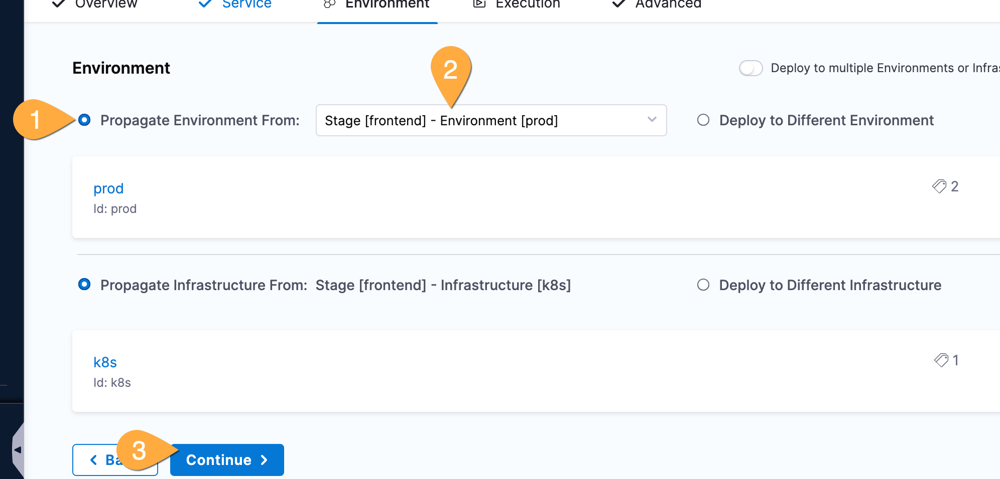
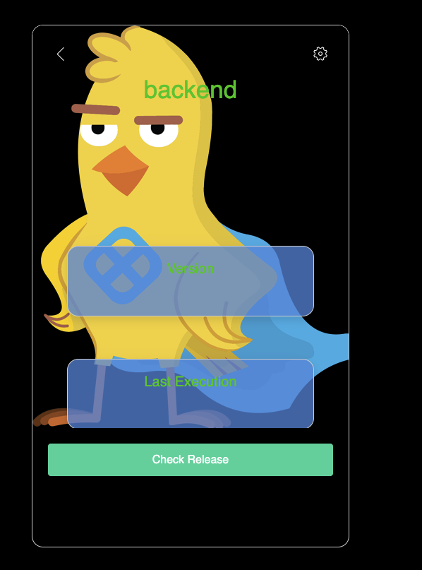

---
sidebar:
  order: 5
title: "Lab D - Deploy Backend"
---

## Goals

Update our pipeline with a backend that leverages additional templates and new release strategy.

## Lab Guide

     ### Create Stage

1. In the Pipeline Studio, click **Add Stage** at the top and select **Deploy**.
1. In the Stage pane:
   Name the stage `backend`
   For Deployment Type, select **Kubernetes**
   click **Set Up Stage**
1. On the service pane:
   In the Select Service field, choose `backend`
   Click **Continue**
1. On the environment pane: **1** Click **Propage Environment from**, **2** select stage frontend - environment prod, **3** click **Continue**
   
1. In the Execution Strategy pane:
   Click **Canary**, then **Use Strategy** (bottom right!)
1. In Pipeline Studio, click **Save**, then click **Run** (top right!)

   ### Check Canary Deployment

1. While the release is running, try switching to the application tab and click **Check Release** a few times. You might catch the canary!
   
