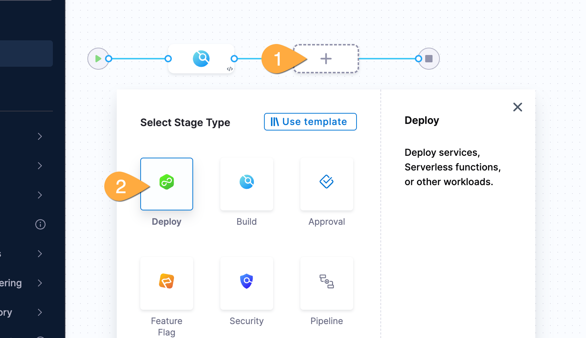
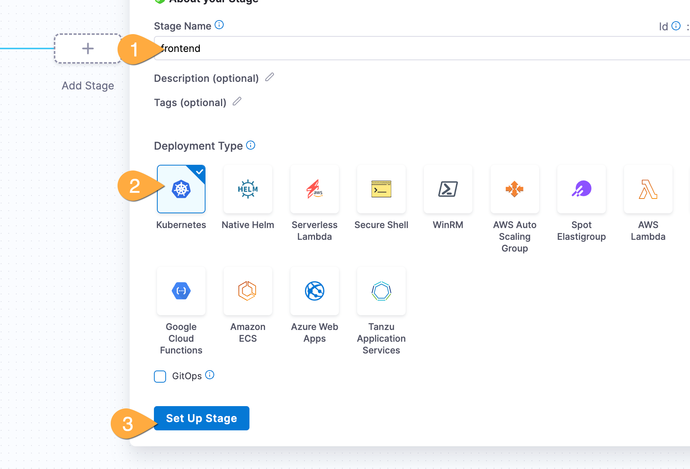
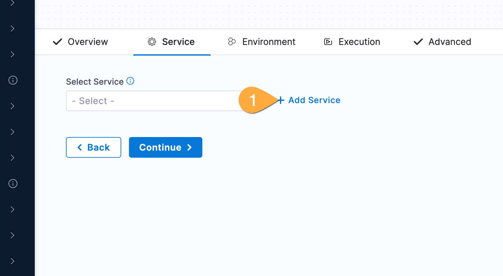
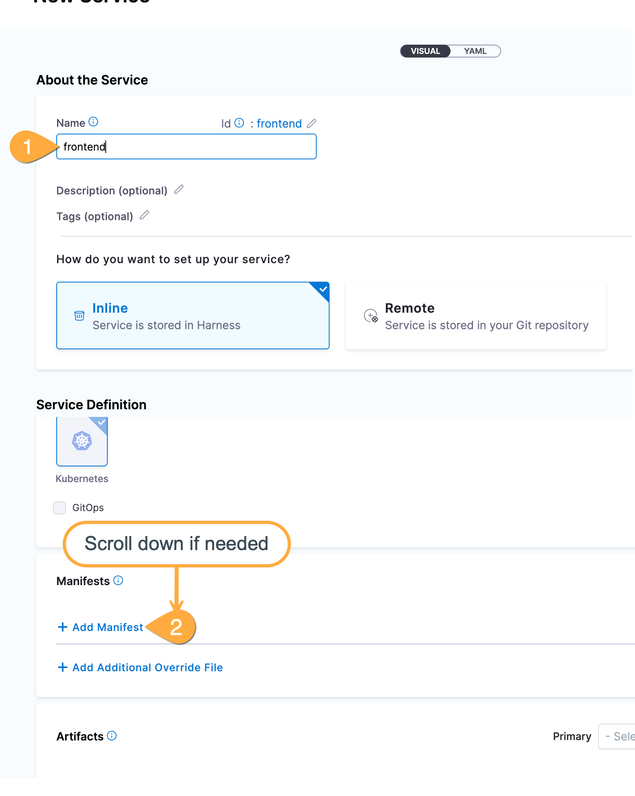
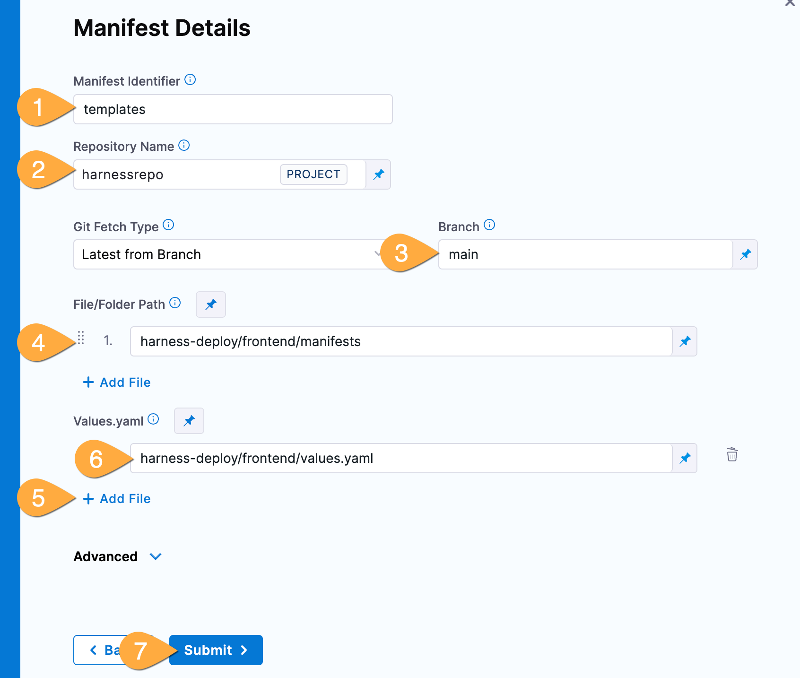
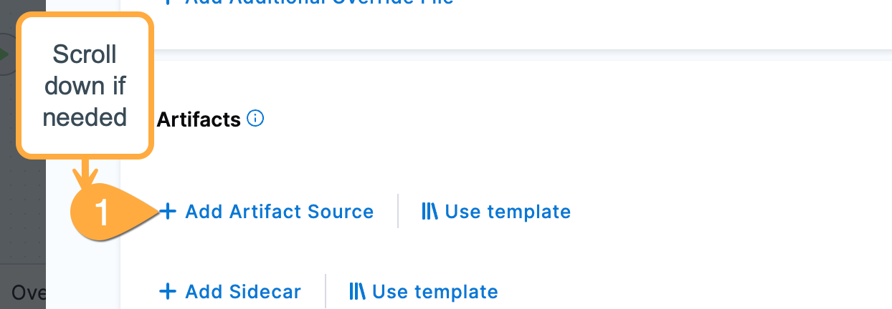
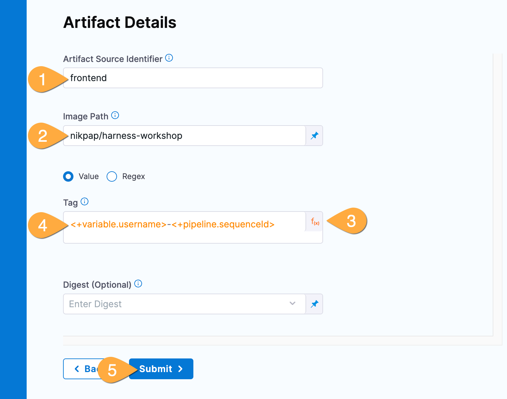
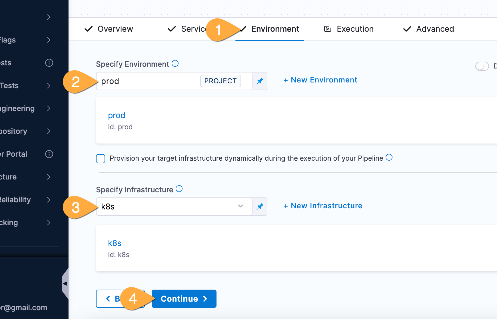
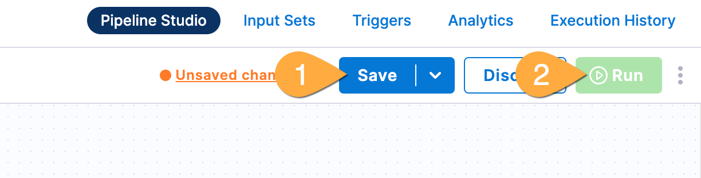

---
sidebar:
  order: 4
title: "Lab C - Deploy Frontend"
---

## Goals

We'll add a new stage for deployment including easy-to-use deployment strategies, see how variables facilitate reusability, and effortlessly create and deploy kubernetes workloads.

## Lab Guide

### Add the new deployment stage

1. In pipeline studio: **1** click **Add Stage**, **2** **Deploy** as the Stage Type
   
1. In the stage pane: **1** enter name `frontend`, **2** click **Kubernetes** for Deployment Type, **3** click **Set Up Stage**
   
1. In the service pane: **1** click **+Add Service**
   
1. In the new service pane: **1** name the manifest `frontend`, **2** click **Add Manifest**
   
1. Click **k8s manifest** then click **Continue**.
1. Click **Code** then click **Continue**.
   ### Add manifest
1. In the details page:  
   **1** give the manifests the name `templates`  
   **2** pick `harnessrepo` from the repository dropdown  
   **3** use `main` for the branch  
   **4** In the **File/Folder Path** paste the value:
   ```
   harness-deploy/frontend/manifests
   ```
   **5** Click **+Add File**
   **6** In the Values.yaml field, paste the value:
   ```
   harness-deploy/frontend/values.yaml
   ```
   **7** Click **Submit**
   
   ### Add the artifact
1. Back in the service setup page: **1** Click **Add Artifact Source**
   
1. In the Artifact Repository Type: click **Docker Registry**, then **Continue**
1. In Connector selection page: pick `DockerHub` from the list, then **Apply Selected**, then **Continue**
1. In the artifact details pane:  
   **1** name the artifact `frontend`  
   **2** in the Image Path field, paste the value:
   ```
   nikpap/harness-workshop
   ```
   **3** Click the field type box and change it to **Expression**  
   **4** In the tag field, paste the value:
   ```
   <+variable.username>-<+pipeline.sequenceId>
   ```
   
   ### Leverage platform team provided Environment and Infrastructure
1. back in Pipeline Studio: **1** click **Environment**, **2** select **prod** from environment list, **3** **k8s** from the Infrastructure list, **4** click **Continue**
   
   :::note
   With Harness, a platform team can easily create and manage environments and infrastructure, then developers can use them to deploy their applications.  
   :::
1. In the Execution Strategies popup: Click **Rolling** in the top left, then **Use Strategy** in the bottom right.
   ### Run updated pipeline
1. Back in Pipeline Studio (top right): **1** Click **Save\*, **2** Click **Run\*\*
   
