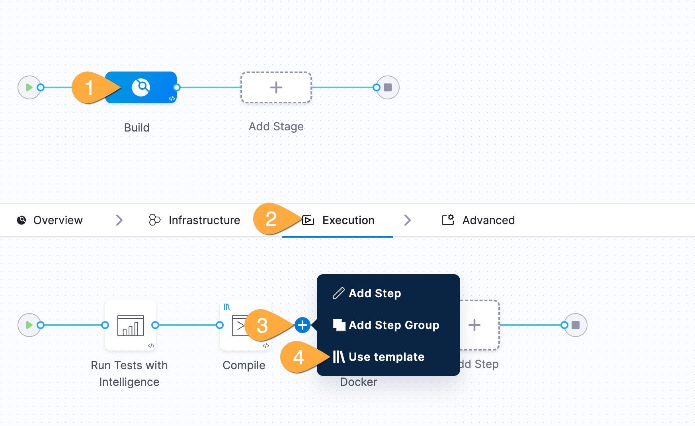

---
sidebar:
  order: 3
title: "Lab B - Governance"
---

## Goals

With Harness, governance and security is paramount- and the platform is uniquely built to provide peace of mind for security teams while empowering software delivery.

In this section, we'll get a view of how a security team could implement critical security policies.. and then show how developers can elegantly, easily meet those policies.

## Lab Guide

:::tip[There can be only one!]
The steps below are just to show how it can be done- you won't have access directly since it's done outside the typical lab permissions. We just need 1 person to be the security team here. Sorry. I'm not sure how to pick. Maybe the first person to call out "Highlander" gets to be the security team? Is that even still a thing? I feel old.
:::

    ### Security Team - implement policy

1. Just for the one person assigned as security team:  
   Click **organization** at the top of page  
   Click **Organization Settings** on the left  
   Scroll down to **Security and Governance** and click **Policies**  
   Click **Policy sets** in the top right  
   View the policy with the mini hamburger button and \*_edit_  
   Finally, flip the switch of "enforced" to on

   ### Development team - What does it mean?

1. In Pipeline Runner: click **Re-run Pipeline**, then click **Re-run pipeline**
1. A popup will show an upcoming security deadline requiring security

   ### Development team - Meet the policy!

1. In the top right of Pipeline Runner: click **Edit Pipeline**
   
1. In the pipeline: **1** click **Build**, **2** click **Execution**, **3** hover and click before small add symbol, **4** add template
   
1. Instead of add step select use template\

1. Select **DevX Fortify Scan**

1. Name the step **Fortify**

1. In the existing pipeline, within the Build stage **after** PushToDockerhub step click on the plus icon to add a new step

1. Instead of add step select use template

1. Select **OWASP**

1. Name the step OWASP

1. Click **Save** and then click **Run** to execute the pipeline with the following inputs

| Input       | Value | Notes |
| ----------- | ----- | ----- |
| Branch Name | main  |       |

After the **Build and Push** stage is complete, go to the **Security Tests** tab to see the deduplicated, normalized and prioritized list of vulnerabilities discovered across your scanners.
