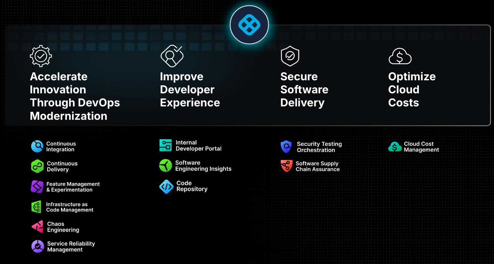
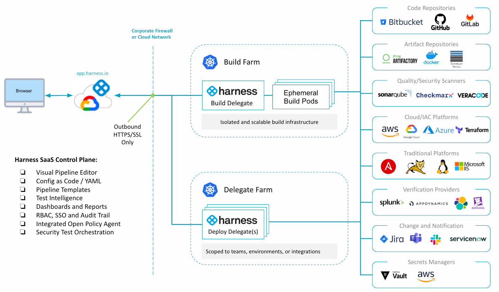
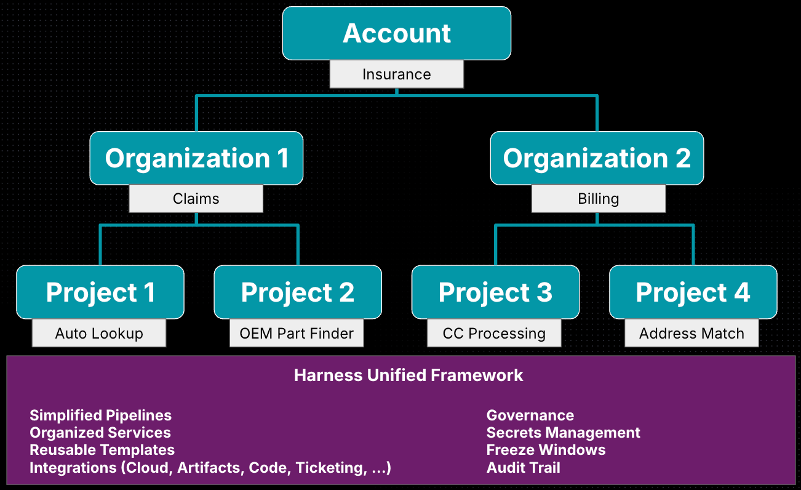
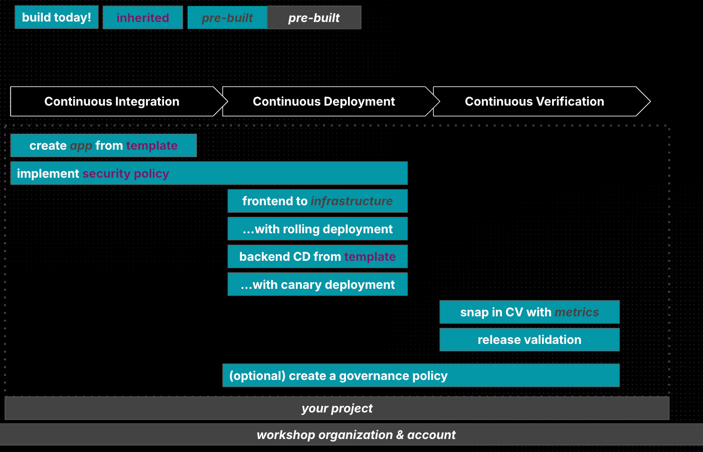

---
sidebar:
  order: 1
title: "Workshop Introduction"
prev: false
tableOfContents: false
---

## Harness Platform

## Harness Architecture

## Harness Hierarchy

## What we're building today

## Who should use this workshop?

This workshop is a great fit for anyone who wants to build and move great software out into the world for people to use... or anyone who leads those teams!

It's extra awesome because you'll get to switch between multiple roles including...

- a software developer ready to commit code over a new pipeline
- a security team member able to confidently ensure standards are met across every pipeline
- a release manager ensuring everything works as expected for customers
- the customer using the application

all using the powerful unified Harness platform together to deliver amazing results.
