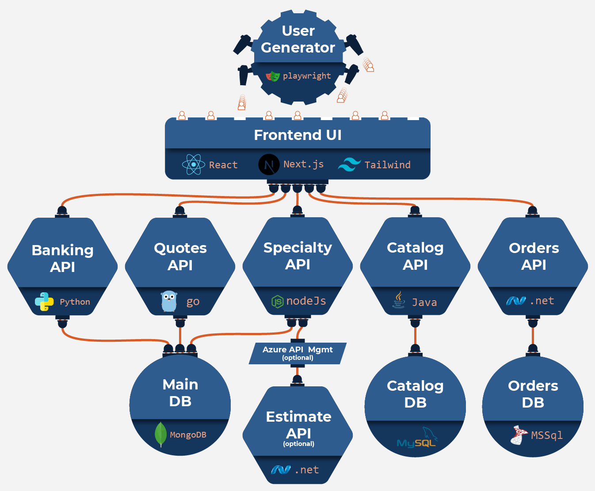

---
sidebar:
  order: 1
title: "Workshop Introduction"
prev: false
tableOfContents: false
---

## Typical Agenda

1. Introductions
2. About Harness / Workshop

- Brief overview of Harness workshop environment
- Build a CICD pipeline from scratch... in minutes!
- Enable security and governance confidently to all pipelines
- **BREAK**
- Leverage templates that make security compliance a snap
- Add continuous verification through easy-to-use integration
- Snap in the off-the-shelf canary release strategy to existing pipeline
- (optional) deep-dive into Policy as Code or other capabilities

3. Q&A

## Harness Platform

## Harness Architecture

## Harness Hierarchy

## What we're building today

## Globalcorp overview

## Who should use this workshop?

This workshop is a great fit for anyone who wants to build and move great software out into the world for people to use... or anyone who leads those teams!

It's extra awesome because you'll get to switch between multiple roles including...

- a software developer ready to commit code over a new pipeline
- a security team member able to confidently ensure standards are met across every pipeline
- a release manager ensuring everything works as expected for customers
- the customer using the application

all using the powerful unified Harness platform together to deliver amazing results.

## Logistics for today

- Phone Calls
- Restrooms
- Keep in mind, this is a live exercise!  
  [click for Harness "workshop outcomes reference"](/images/rafting.jpg)
