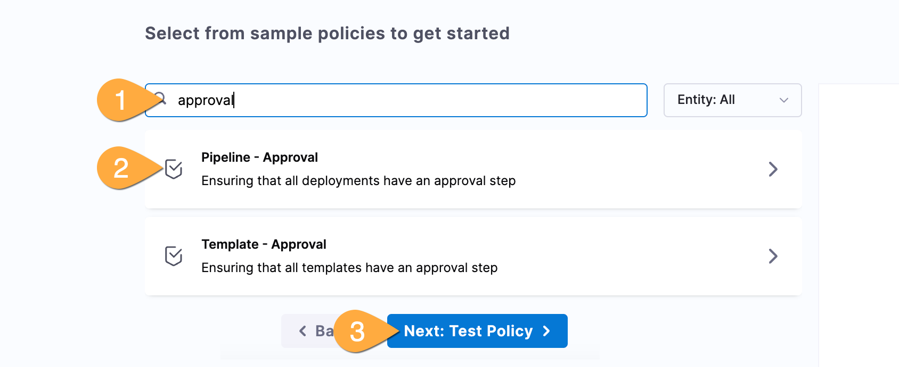

---
sidebar:
  order: 8
title: "Lab G - Policy as Code"
---

## Goals

See how easy it is with Harness to create and apply policies as code in order to enable governance and promote self-service.

## Lab Guide

1. If you see the edit pipeline button top right, click to return to the Pipeline Studio.

### Implement policy from library

1. On the left menu, **1** click **Project Settings** (you might need to scroll down)
   
1. In project settings, scroll down to _Security and Governance_ and **1** click **Policies**
   
1. In the Welcome screen: click **Build a Sample Policy**
1. In the Policy pane: **1** (optional) type `approval`, **2** click **Pipeline Approval**, **3** click **Next: Test Policy**
   
1. In the Test Policy pane: click **Next: Enforce Policy**
1. In the Enforce Policy pane: **1** In Trigger event, choose **On Run**, **2** In Failure Strategy, choose **Error & exit**, **3** click **You're all set!**
   
1. In the **Apply Policy?** pop-up: click **Yes**

   ### Test your new policy!

1. Return to your pipeline by: **1** Click **Pipelines** in the left menu (might need to scroll up), **2** click the **Workshop** pipeline
   
1. In the top right corner of your pipeline: click **Run**. Confirm you receive an error regarding your policy.
1. Edit your pipeline: **1** Click on **frontend** stage, **2** at very beginning stage, hover then **click** on blue arrow, click **Add Step**
   
1. In the Step Library, (optionally) search for `approval`, then **Click** on **Harness Approval**
1. In the Approval step: name the step `Approval`, scroll down then **1** Click on **User Groups** box.
   
1. In the user group selector: **1** click on **Project**, **2** check **All Project Users**, **3** Click **Apply Selected**
   
1. Back in the Approval step: Click **Apply Changes** (top right)
1. In Pipeline Studio: **1** click **backend** stage, after canary/before rolling release hover then **click** on blue arrow, click **Add Step**
   
1. Same as above, add Approval step in the library, scroll to user groups, and add all project users.

   ### Run your successful pipeline one final time

1. In the top right of screen, click **Save**, then click **Run**.
