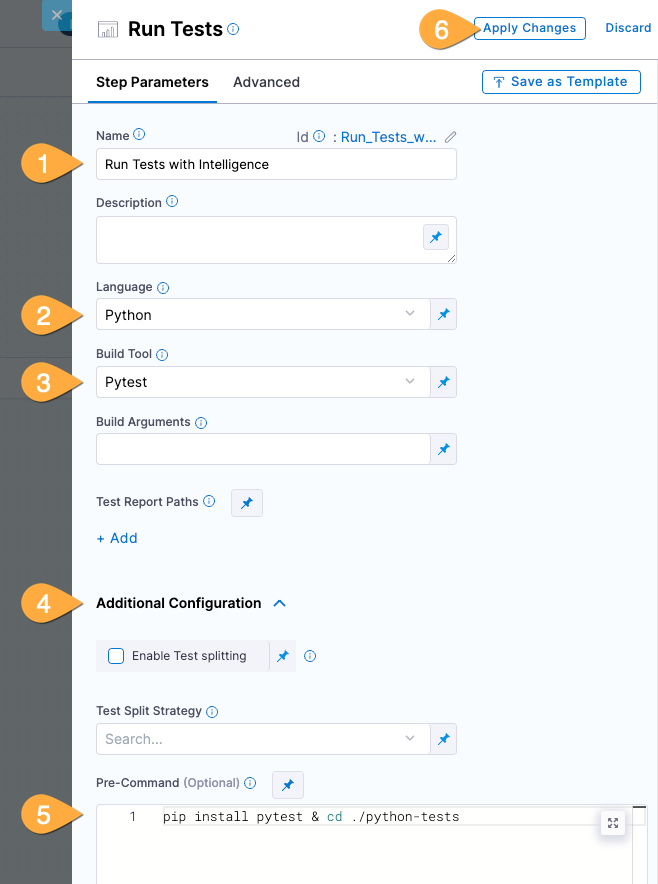
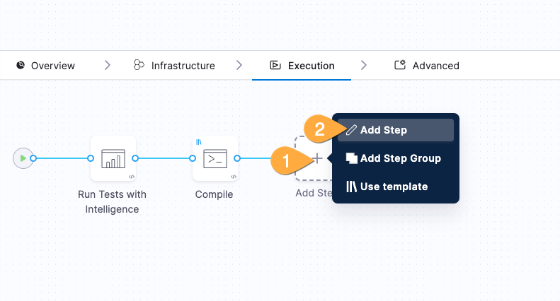

---
sidebar:
  order: 3
title: "Lab A - Build Software"
---

import Update from "/src/components/Script.astro";

<Update />

# Goals

We'll setup a CI Pipeline with source code tests, build, and then push the artifact to a remote repository!

## Steps

1. In Harness:
   | click: |#|
   | -------- | -------|
   | Projects (blue bar) |1|
   | Your Project: ?project |2|

   

2. If you see the Welcome screen with **Get Started** pane, kick it to the curb with the "X" top right. 

### Our first pipeline

1. Return to the Harness Platform tab then: **1** click **Pipelines**, **2** Click **Create a Pipeline**
   
1. In the box that pops up: **1** give your pipeline a name, **2** click **Inline**, **3** click **Start**
   
   :::note[Inline vs. Remote]
   We're using inline for this lab, but you can also use a remote repository like GitHub. This is useful for teams that want to keep their _pipelines as code_ bundled up snuggly with _application code_. Cozy!
   :::
1. then: **1** click **Add Stage**, **2** **Build** as the Stage Type
   
1. then: **1** enter any name (ex: `build`), **2** ensure **Clone Codebase** is selected, **3** click for repo selector and pick **harnessrepo**, **4** click **Set Up Stage**
   

   ### Configure the infrastructure and tests

1. On the infrastructure page: **1** click **Cloud**, **2** click **Continue**
   
   :::note[Harness Cloud is the BESTEST cloud]
   Something awesome happened right there. With zero configuration (well ok... ooooooone click!) you instantly configured an autoscaling build environment in the cloud that requires no management on your part and is dramatically less expensive than on-premise.
   Plus Harness is using the [fastest bare-metal hardware](https://www.harness.io/products/continuous-integration/ci-cloud) in the Solar System. Seriously. Astronauts checked.
   :::
1. On the execution page: **1** click **Add Step**, **2** click **Add Step**
   
1. In the Step Library: **1** (optional) type `tests` in search box, **2** click **Run Tests**
   
1. In the Run Tests pane: **1** name the test `Run Tests with Intelligence`, **2** choose python, **3** Pytest, **4** Click **Additional Configuration** to expand...

   ...**5** copy and paste the install command below into the **Pre-Command** field...

   ```bash frame="none"
   pip install pytest & cd ./python-tests
   ```

   ... then: **6** click **Apply Changes**
   

   ### Leverage a template for software build!

1. Back in the Execution pane: **1** click **Add Step**, **2** click **Use Template**
   
1. In the Template Library: **1** click **Compile Application**, **2** click **Use Template** (far bottom right of screen)
   
1. In the template box: **1** name the template `Compile`, **2** click **Apply Changes**
   

   ### Save the completed build artifact

1. Back in the Execution pane: **1** click **Add Step**, **2** click **Add Step**
   
1. In the Step Library: **1** type `docker` in search box, **2** click **Build and Push an image to Dockerhub**
   
1. In the Build and Push pane:  
   **1** name the step `Push to DockerHub`  
   **2** select `dockerhub` for Docker Connector  
   **3** for Docker Respository paste:

   ```bash
   nikpap/harness-workshop
   ```

   **4** click **+Add** in Tags, then paste:

   ```bash
   <+variable.username>-<+pipeline.sequenceId>
   ```

   **5** Click **Optional Configuration** to expand  
   **6** For DockerFile paste:

   ```bash
   /harness/frontend-app/harness-webapp/Dockerfile
   ```

   **7** For Context paste:

   ```bash
   /harness/frontend-app/harness-webapp
   ```

   **8** Click **Apply Changes**. That was the biggest step in the workshop, you did it! ⭐️
   

1. In the top right of Pipeline Studio: **1** click **Save**, **2** click **Run**
   
   :::note
   You might have noticed an option to pick the branch before running the pipeline. We're using `main` for simplicity, but it's a great example of how this complete build pipeline could easily be reused for other branches (or repositories or services).
