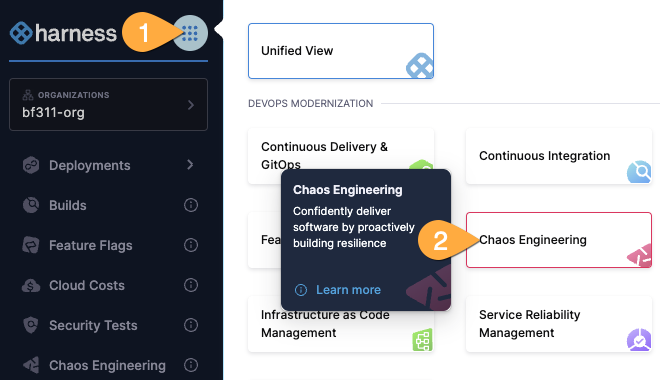
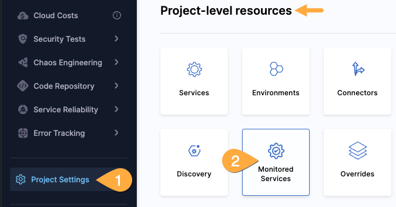
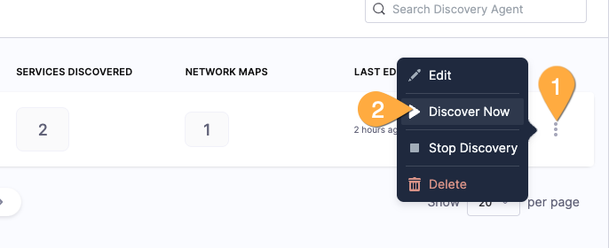
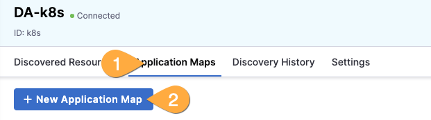
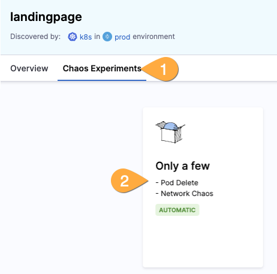
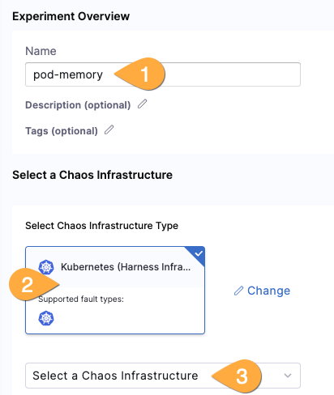
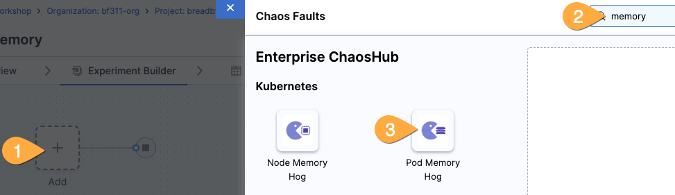
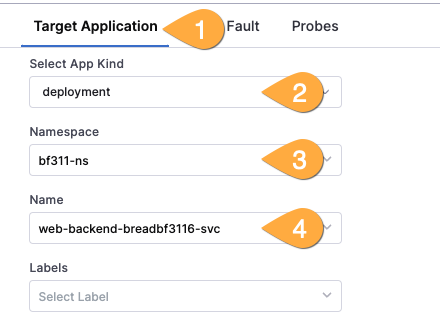

---
sidebar:
  order: 8
title: "Lab F - Chaos Engineering"
---

## Goals

We'll run automatic application discovery to identify our layout and then introduce chaos experiments to test resiliency.

## Lab Guide

### Chaos Engineering

1. Using the mega-hamburer button, switch to the Chaos Engineering pane.
   

### Application Discovery

1. On the left-side blue menu, choose _project settings_, scroll to Project-level resources, then the _Discovery_ tile.
   
1. On the DA-k8s line, on the far right, click the hamburger button, then _Discover Now_.
   
1. Click on _DA-k8s_, then _Application Maps_, then _+create new application map_.
   
1. Name it similar to `landingpage` and then select all services, then _save_ in the top right.

### Setup automatic chaos experiments

1. In the blue left menu, click _Application Maps_, then click on your new application.
1. Select _Chaos Experiments_ at the top, then the _Only a few_ tile.
   
1. Review the experiement selected and then click _run_ in the top right corner.

### Setup a custom chaos experiment

1. In the left blue menu, click _Chaos Experiments_, then _+New Experiment_.
1. Give it a name similar to `pod-memory`, then *Kubernetes (Harness infra), *then _Select a Chaos Infrastructure_.
   
1. Ensure _prod_ is selected, click _Next_, ensure _k8s_ is selected, then _Apply_.
1. CLick _Next_, then _start with blank canvas_.
1. Click the _Add_ tile, (optional) search for `memory`, and select the _Pod Memory Hog_ fault.
   
1. Select _Target Application_, _deployment_ type, the org's namespace, and name.
   
1. Select the _Tune Fault_ tab, _300_ for chaos duration, _300_ for memory consumption, and _1_ for workers.
