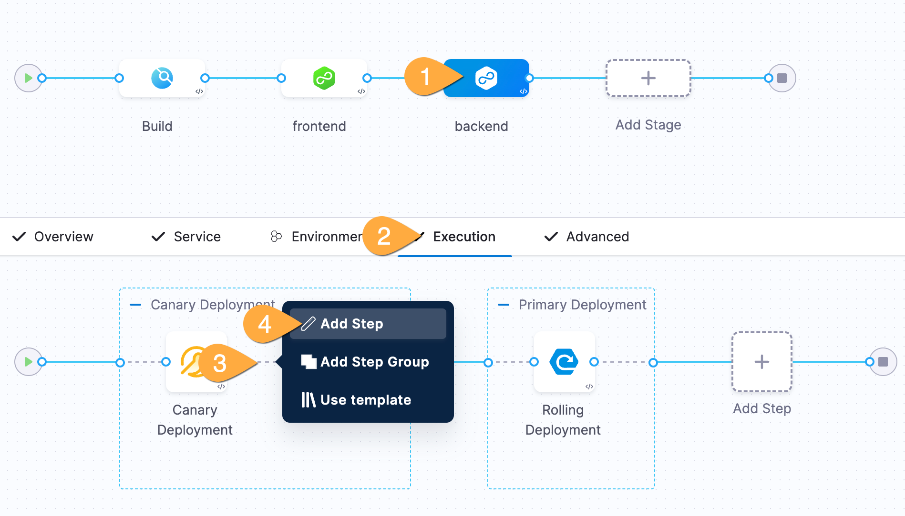
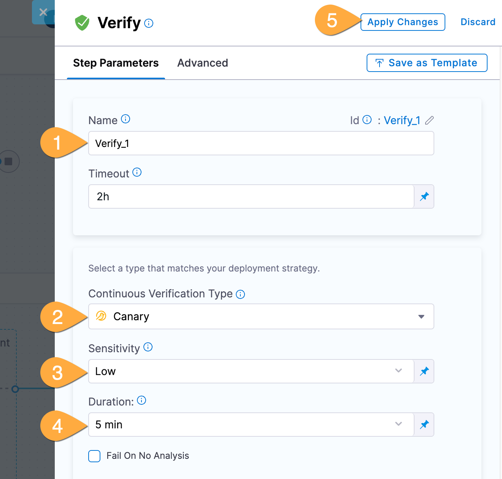
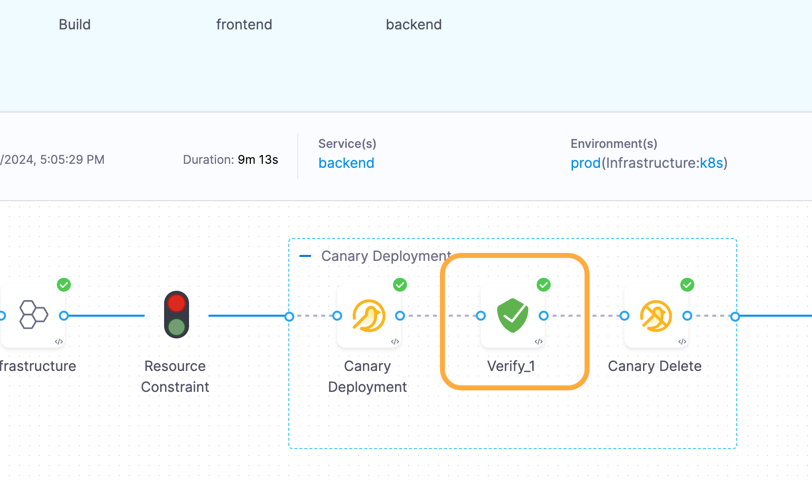

---
sidebar:
  order: 9
title: "Lab G - Continous Verification"
---

## Goals

Add Continuous Verification to the pipeline to automate the validation of new releases.

## Lab Guide

1. If you see the edit pipeline button top right, click to return to the Pipeline Studio.
   ### Add Continuous Verification
1. In Pipeline Studio: **1** click **Backend** stage, **2** ensure **Execution** is selected, **3** hover and click the little **blue plus** between canary deploy and delete, **4** click **Add Step**
   
1. In the Step Library, (optionally) type verify in the search box, click **Verify**.
1. In the verify pane: **1** name the step `Verify`, **2** select **Canary** for Continuous Verification Type, **3** select **Low** for Sensitivity, **4** set **Duration** to 5mins, **5** click **Apply Changes**
   
1. In the top right corner of Pipeline Studio: click **Save**, then **Run**.
   ### Validate the release
1. Hang tight until your pipeline reaches the "Verify" stage.
1. Switch to your application tab, then in the Distribution Test section, click **Start**, then click the "play button".
   :::note
   It might take 30-45 seconds to start. Just hang tight!
   :::
1. After several minutes, check on the pipeline. The Verify step should be green!
   
