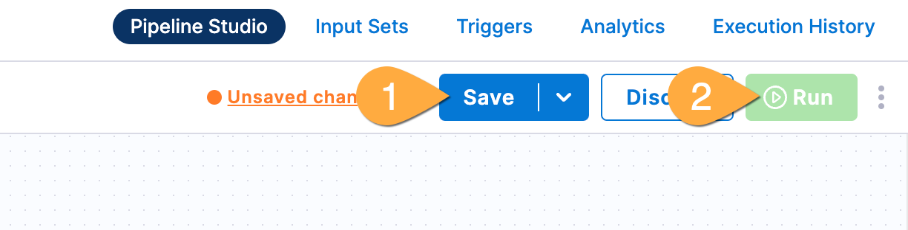

---
sidebar:
  order: 3
title: "Lab B - Governance"
---

:::note[Starting here?]
If you start here (or just joined an event in progress):

1. Open your project and go to `pipelines`.
1. Click 
1. Name the pipeline `End to End Deployment`
1. Click 
1. Select `Lab A Complete` then 

:::

## Goals

With Harness, governance and security is paramount- and the platform is uniquely built to provide peace of mind for security teams while empowering software delivery.

In this section, we'll get a view of how a security team could implement critical security policies.. and then show how developers can elegantly, easily meet those policies.

## Lab Guide

:::tip[Wyatt, You're an OAK]
The steps below are just to show how it can be done- you won't have access directly since it's done outside the typical lab permissions. We just need 1 person to be the security team here. Sorry. I'm not sure how to pick. Maybe the first person to call out "I'm your Huckleberry" or ["GO ahead, skin that smokewagon and see what happens"](https://www.youtube.com/watch?v=Yq34rCkcY0M) gets to be the security team? Is that even still a thing? I feel old.
:::

    ### Security Team - implement policy

1. Just for the one person assigned as security team:  
   Click **organization** at the top of page  
   Click **Organization Settings** on the left  
   Scroll down to **Security and Governance** and click **Policies**  
   Click **Policy sets** in the top right  
   View the policy with the mini hamburger button and \*_edit_  
   Finally, flip the switch of "enforced" to on

   ### Development team - What does it mean?

1. In Pipeline Runner: click **Re-run Pipeline**, then click **Re-run pipeline**
1. A popup will show an upcoming security deadline requiring security

   ### Development team - Update to meet standards, fast!

1. In the top right of Pipeline Runner: click **Edit Pipeline**
   
1. In the pipeline: **1** click **Build**, **2** click **Execution**, **3** hover and click blue add symbol, **4** click **Use template**
   
1. In the templates pane: click **Devx Fortify Scan**, then click **Use Template** (bottom right corner!)
1. In the template pane: name the template `Devx Fortify`, then **Apply Changes**
1. Back in Pipeline Studio: **1** click the "big" add button at the end of pipeline, then **2** use template
   
1. In the template pane: click **Owasp**, then **Use Template** (bottom right corner!)
1. In the template pane: name the template `Owasp`, then **Apply Changes**
   ### Run updated pipeline
1. Back in Pipeline Studio (top right): **1** Click **Save\*, **2** Click **Run\*\*
   
