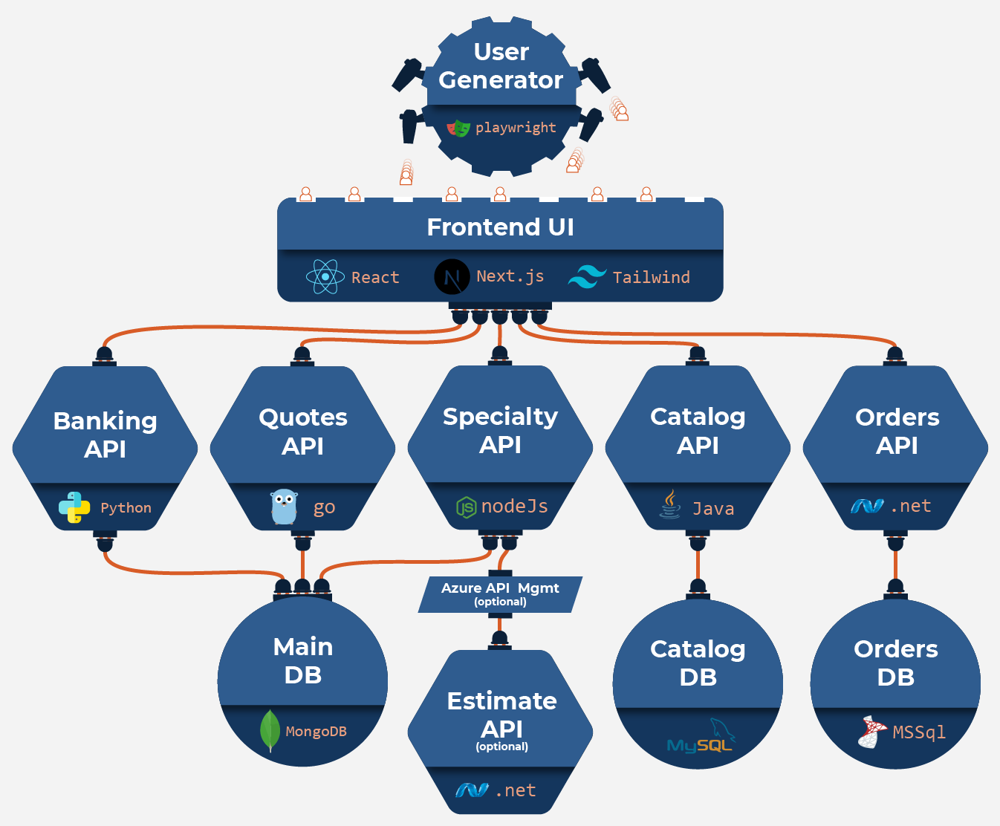

---
sidebar:
  order: 1
title: "Introduction"
prev: false
tableOfContents: false
---

import Parameters from "/src/components/Parameters.astro";
import Update from "/src/components/Script.astro";

<Update />

## Typical Agenda

1. Introductions
2. About Harness
3. Event overview
4. Labs (as selected by your team)  
   (breaks as requested)
5. Q&A

## Globalcorp overview

For the event today, we'll all be working for the fictious GlobalCorp company. Depending on Labs and capabilities selected by your team, we'll work in various parts of the application shown below.



## Logistics

- Phone Calls
- Restrooms
- Keep in mind, this is a live exercise!  
  [click for Harness "workshop outcomes reference"](/images/rafting.jpg)

## Conventions

You'll find these conventions used throughout the guide:

### Callouts

:::tip
Tip blocks provide helpful insight for a particular Harness feature.
:::

:::caution
Caution blocks highlight the (few) areas where it helps to double-check steps to make sure they match the instructions/spelled correctly.
:::

<details>
  <summary>psst... </summary>
  Detail blocks provide additional info or deep dive details that aren't critical for the event. But provide context for those fabulous
  go-getters who like to know the "how". Here's your first gold star 🌟, you teacher's pet, you!
</details>

### Step Blocks

UI-based instructions. Typically accompanied by a pretty snazzy picture with # indicating where to click.

| click:                | #   |
| --------------------- | --- |
| Click this thing      | 1   |
| And that other thing! | 2   |
| Move it               | 3   |

### Code Blocks

Handy blocks with pre-formatted text that, when hovered over, offer a copy button. When clicked, you can paste the result directly into Harness.

```
hover to show copy button ->
```

## Next Steps

Typically the event will move into Base Camp. This is where you can confirm your computer is setup for the event and get a quick tour before diving into the first Lab.
