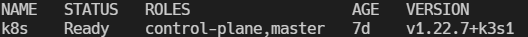

# Why create these?

For me... "quickstart" tutorials that install everything for you via script or pack together incomprehensible code blocks to copy/paste are frustrating!

I feel helpless when it inevitably breaks because I had no idea what I built. Attempts to fix things make things worse. Eventually I delete the whole project and pretend I never cared about that topic anyway.

But... I don't have endless study time for topics that aren't part of my current IT role. And if I'm 100% honest, I get bored entirely too easily and YouTube knows what off-topic videos to sneak into _up next_ queue.

If you are looking for the right "in-between" fit, I hope this tutorial series will split the extremes and give you something usable long term. LFG!

## Indicators

Examples of things you might find in the tutorial section to help out.

<details>
  <summary>Dropdowns</summary>Dropsdowns provide background around commands or concepts.
</details>

:::info
Info/Tip blocks provides alternatives to commands.
:::

:::tip
Tip Block
:::

```bash
This is a code block.
```

- bulleted list item 1
- bulleted list item 2
- bulleted list item 3

An image

